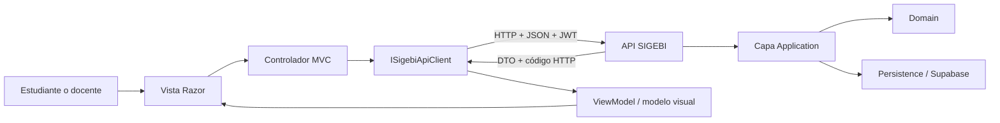

# Integración Web de la capa de Aplicación con Presentación

## 1. Arquitectura de la solución

Este documento cubre exclusivamente el portal **Web MVC**, correspondiente al
autoservicio de estudiantes y docentes. La aplicación Desktop del personal
bibliotecario pertenece al alcance de otro integrante. La Web consume la API
central y nunca accede directamente a Persistence ni a Supabase.



La presentación se limita a capturar datos, validar formato, orquestar la
interacción y renderizar resultados. Las reglas de préstamos, multas,
inventario, permisos y disponibilidad permanecen en Application/Domain.

## 2. Integración con la API

Web registra `ISigebiApiClient` mediante `IHttpClientFactory`; sus controladores
dependen de esa interfaz y preparan ViewModels para Razor. El servicio Web
serializa y deserializa JSON, envía el JWT como `Bearer` y traduce respuestas
400, 401, 403, 404, 409 y 500 a mensajes adecuados para el usuario.

La comunicación contempla timeout e indisponibilidad: Web transforma fallos de
transporte en respuestas visuales 503/504 mediante un filtro MVC global. Las
cancelaciones solicitadas por el usuario conservan su comportamiento normal.

## 3. Estrategia de consumo y componentes

- `GET`: perfil, resumen, catálogo, detalle bibliográfico, solicitudes, préstamos, multas y notificaciones.
- `POST`: autenticación, registro, recuperación de acceso y solicitudes.
- `PUT`: cambio de contraseña y marcado de notificaciones como leídas.
- `DELETE`: cancelación de solicitudes pendientes.

Razor utiliza ViewModels, Tag Helpers, validación por DataAnnotations,
antiforgery tokens y scripts de validación no intrusiva. Los estados vacíos y
mensajes temporales se renderizan mediante Partial Views reutilizables. La API
aplica las validaciones de negocio y la autorización definitivas. Las acciones
sensibles, como cancelar una solicitud, requieren confirmación visual antes de
enviar la operación a la API.

## 4. Verificación funcional

Las pruebas automatizadas Web cubren datos válidos e inválidos, propagación de
errores de validación, ciclo Vista → controlador → API → Vista, JWT,
API no disponible y timeout. La evidencia visual debe incluir al menos cinco
módulos Web: autenticación/recuperación, dashboard, catálogo, solicitudes,
préstamos, multas, notificaciones y cuenta.

Comandos de verificación:

```powershell
dotnet build SIGEBI.slnx -c Release
dotnet test SIGEBI.Tests/SIGEBI.Tests.csproj -c Release --no-build
```

## 5. Conclusiones

La integración mantiene bajo acoplamiento, responsabilidades claras y una única
fuente de reglas de negocio. El portal Web reutiliza los contratos de la API,
presenta validaciones y errores de forma consistente y puede evolucionar sin
vincular la interfaz a Persistence. El flujo cumple la separación y las
evidencias técnicas requeridas por los lineamientos de la capa de presentación.
